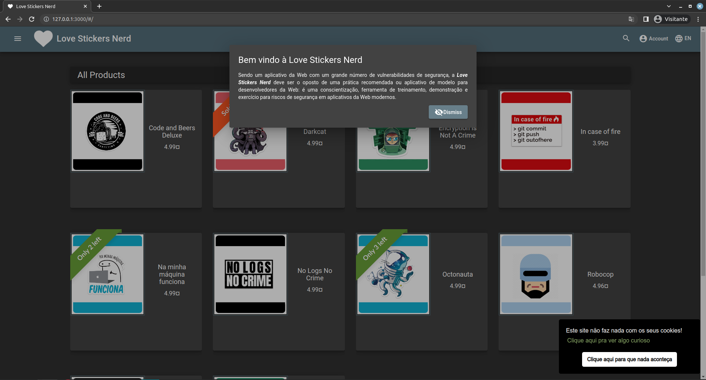

# Love Stickers Nerd
```
***************** P-R-E-R-I-G-O ☠️ ***********************
Não execute esta aplicação em um ambiente web ou 
junto com outras aplicações de produção. 
*********************************************************
```
Sendo um aplicativo da Web com um grande número de vulnerabilidades de segurança, a **Love Stickers Nerd** deve ser o oposto de uma prática recomendada ou aplicativo de modelo para desenvolvedores da Web: é uma conscientização, ferramenta de treinamento, demonstração e exercício para riscos de segurança em aplicativos da Web modernos.

**Leia as recomendações de segurança [clicando aqui](./config/README.md).**  

## Iniciando a aplicação:
```bash
git clone https://github.com/jeanrafaellourenco/owasp-juice-shop.git
cd owasp-juice-shop/
docker-compose up --build -d
```
Após iniciar a aplicação, acesse no seu navegador o seguinte endereço: [http://127.0.0.1:3000](http://127.0.0.1:3000).  

Se tudo ocrreu bem você deverá ver a tela de boas vindas:  



Vamos utilizar o aplicativo Web vulnerável baseado no [Pwning OWASP Juice Shop](https://pwning.owasp-juice.shop/) para aprender a identificar e explorar vulnerabilidades comuns de aplicativos Web.

Reiniciando a aplicação: utilize caso queira reiniciar o progresso. Talvez seja necessário a limpeza de cache do navegador.
```bash
docker-compose up --force-recreate -d
```
### Vá para o [Desafio](DESAFIO.md).

## Tema personalizado
Você pode encontrar informações sobre como customizar uma versão do projeto OWASP Juice Shop em [Pwning OWASP Juice Shop Customization](https://pwning.owasp-juice.shop/part1/customization.html).
