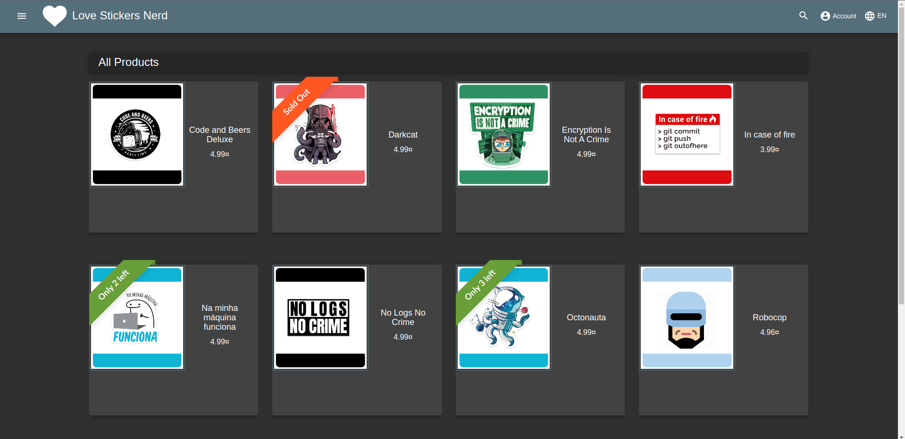

# OWASP JUICE SHOP
Minha versão personalizada do projeto [Pwning OWASP Juice Shop](https://pwning.owasp-juice.shop/)  .




## Tema personalizado
Você pode encontrar informações sobre como customizar uma versão do projeto OWASP Juice Shop em **Pwning OWASP Juice Shop** [Customization](https://pwning.owasp-juice.shop/part1/customization.html).


## Iniciando a aplicação:
```
***************** P-R-E-R-I-G-O ☠️ ***********************
Não execute esta aplicação em um ambiente web ou 
junto com outras aplicações de produção. 
*********************************************************
```
**Leia as recomendações de segurança [clicando aqui](./config/README.md).**

```bash
docker-compose up --build -d  
```
## Reiniciando a aplicação (Utilize caso queira reiniciar o progresso):
```bash
docker-compose up --force-recreate -d
```
#
## Apósiniciar a aplicação vá para o [Desafio](DESAFIO.md).
